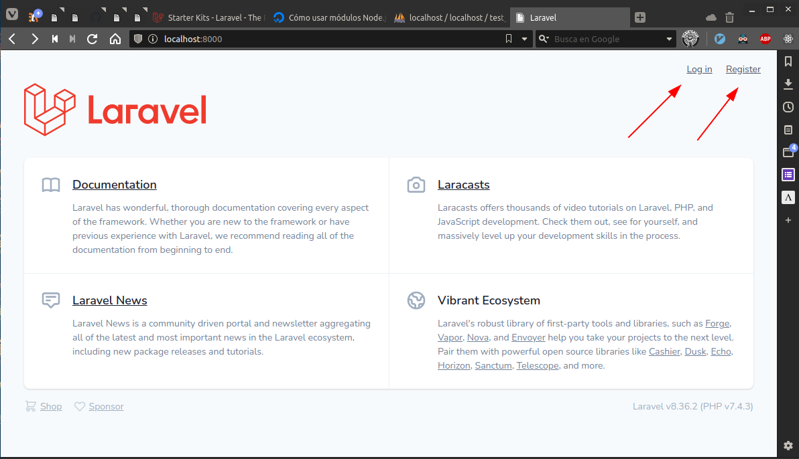

# Parte 2: node.js, npm y Laravel Breeze

## Node.js y nmp

### ¿Qué es node.js?

*Node.js* es un **entorno de ejecución** (_runtime environment_) de código abierto, multiplataforma que permite utilizar el lenguaje JavaScript para realizar tareas propias del **lado del servidor**, de forma asíncrona. Es especialmente útil para crear páginas web dinámicas y que necesiten actualizarse en tiempo real (chats o juegos, p.e).

> Un [runtime environment](https://es.wikipedia.org/wiki/Sistema_en_tiempo_de_ejecuci%C3%B3n) es un software que da servicios a un programa en ejecución, es decir que le sirve de _apoyo_.

Como detalles técnicos, está basado en el motor V8 de Chrome, lo que lo hace muy potente y rápido. Sigue un modelo **asíncrono** y **orientado a eventos**, es decir, que las tareas que se ejecutan no retrasan la ejecución de otras.

### El gestor de paquetes _npm_

Además de lo anterior, _node_ también hace referencia al conjunto de **librerías** y **módulos** que pone a disposición del usuario, y que se nutre mucho de la colaboración de los usuarios en internet.

Para gestionar las librerías y paquetes que necesitemos para un proyecto con node se utiliza _npm_ (_Node Package Manager_). Con él podemos instalar librerías, programas, ejecutarlos, administar dependencias o distribuir código.

### Instalación

_Node.js_ y _npm_ se pueden descargar directamente desde su [página oficial](https://nodejs.org/en/). Aunque también hay paquetes disponibles desde los repositorios oficiales, suelen estar desactualizados, así que lo mejor es ir directamente a la fuente.


El archivo que nos bajamos contiene las librerías necesarias y tres ejecutables en la carpeta `bin`: `node`, `npm` y `npx`; bastante añadir esta carpeta al `$PATH` para instalarlos.


_Comprobamos la versión instalada con `node -v` y `npm -v`_

## Laravel Breeze

Laravel _Breeze_ es un conjunto de vistas y controladores para gestionar el inicio de sesión, registro de usuarios y acciones relacionadas (resetear la contraseña, verificar el email etc) que se puede instalar fácilmente con `composer`, `artisan` y `npm` (para las dependencias de javascript):

```sh
# crea un proyecto básico en blanco
composer create-project laravel/laravel ejemplo-breeze

# entramos al directorio creado
cd ejemplo-breeze

# creamos la base de datos
php artisan migrate

# instalamos las dependencias de breeze
composer require laravel/breeze --dev
php artisan breeze:install
npm install
npm run dev

# creamos las tablas para manejar los usuarios
php artisan migrate
```




