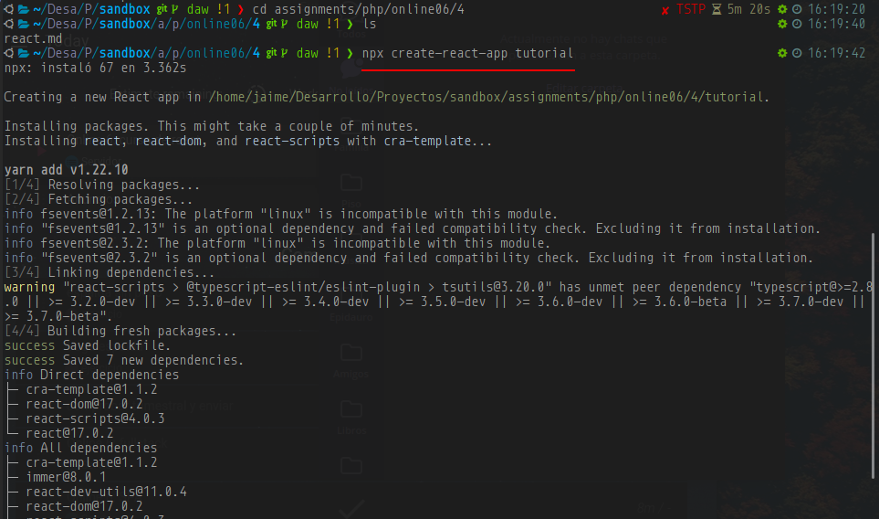
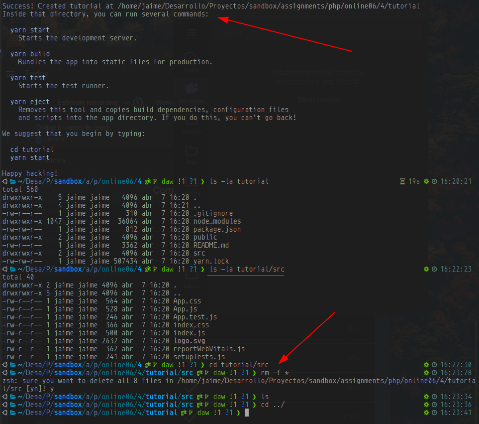
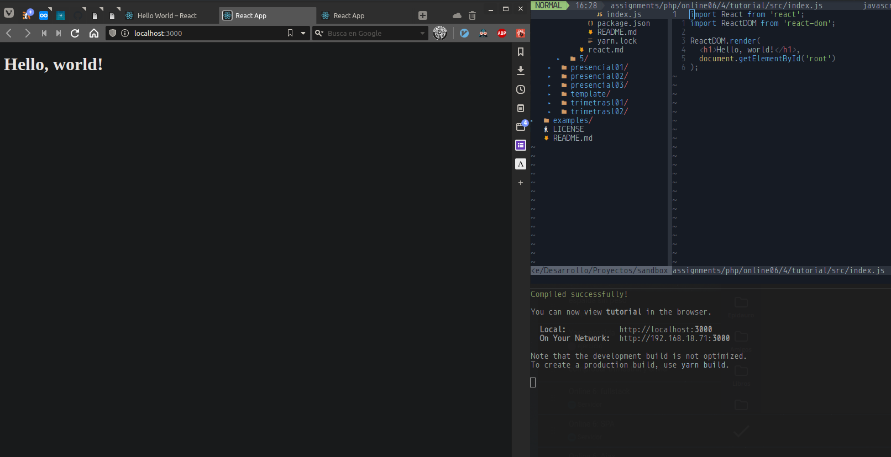

# Parte 4: _React_ básico

Soy de los que aprende practicando, así que antes de empezar con el tutorial,seguí [este](https://reactjs.org/tutorial/tutorial.html) para crear un juego funcional de _tres en raya_ con historial de jugadas y todo. Lo adjunto en esta carpeta.

Para seguir el tutorial he creado un proyecto en blanco con `npx`. Como prueba de que lo he hecho, adjunto el proyecto con algunas capturas. He usado _git_ para separar el código de cada sección, creando **ramas** por cada capítulo del tutorial.

Para hacerlo todo más sencillo limpiamos la carpeta `src` de la carpeta que ha creado. Solo necesitamos un `index.js` desde el que mostraremos lo que haga falta.

> **Copiar proyectos**
> Como ocurre con Laravel, puede haber problemas de dependencias al copiar y pegar un proyecto. Lo mejor es no copiar la carpeta `node_modules` y ejecutar `npm install` en la máquina destino. Esto descargará e instalará las dependencias necesarias.

## Capturas

