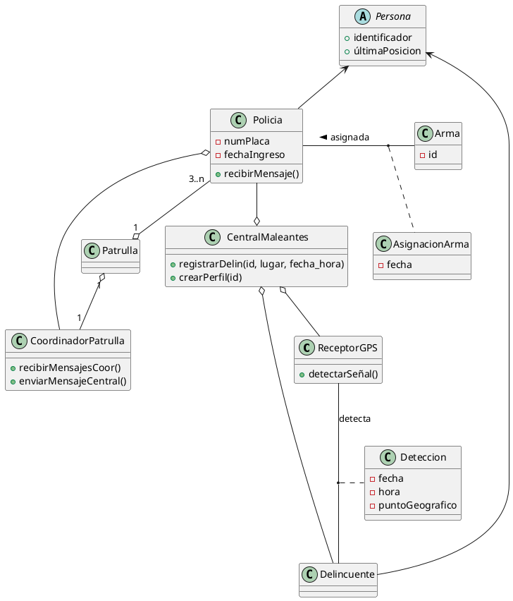

# Comisaría de policía futurista

Neo-Tokio es una smart-city eso quiere decir que cientos-miles de sensores y dispositivos electrónicos se hayan distribuidos por todo el territorio de la ciudad.

Takesu Gouda ha creado un sistema para localizar a los fugitivos de la justicia. A cada delincuente se le ha insertado un chip geolocalizador el cual emite una señal GPS. Cientos de receptores GPS se encuentran situados por toda la ciudad y cuando detectan una señal de un delincuente envían la información a la central de maleantes.

El sistema registrará que un delincuente ha estado situado en un punto concreto a una hora determinada. Este hecho queda registrado y podrá ser consultado por cualquier ciberpolicía. También se podrá conocer el perfil del delincuente y saber qué lugares frecuenta (los 10 puntos geográficos que más frecuenta).

El sistema también ofrecerá cual es la última posición en la que se encuetra el maleante y cual es la última posición de cada ciberpolicía. Si se emite una orden de detención el sistema calculará dónde se puede encontrar el maleante y cuál es el ciberpolicía más cercano para proceder al arresto.

Los policías se mueven en patrullas. Cada policía pertenece a una patrulla. El sistema prevé disgregar patrullas y crear algunas patrullas de asalto fusionando patrullas pequeñas. Las patrullas de ciberpolicías tienen un mínimo de 4 miembros y no tienen máximo. Los responsables no se fían de enviar patrullas de menos de 4 miembros a atrapar delincuentes pues estos disponen de armamento pesado.

En cada patrulla hay un miembro que será el coordinador de la misma. Un coordinador puede enviar mensajes a central y recibir mensajes de coordinador. Los mensajes enviados y recibidos quedan registrados en el sistema.

Asimismo, cualquier ciberpolicía podrá recibir un mensaje de central en cualquier momento.

Los ciberpolicías tienen un arma asignada por dos años. Las armas están registradas y se quiere conocer qué ciberpolicía tiene un arma concreta.

Cada ciberpolicía se distingue de otro por el nombre, identificador, el número de placa y la fecha de incorporación al servicio.

Se pide: Realizar el diagrama de clases.

