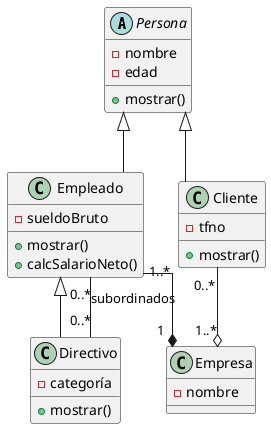

# Empresa

Una aplicación quiere almacenar información sobre empresas, empleados y clientes. Estos dos últimos se caracterizan por su nombre y edad. Los empleados tienen un sueldo bruto y los que son directivos tienen una categoría, además de un grupo de empleados subordinados. De los clientes se necesita conocer también su teléfono de contacto. La aplicación necesita mostrar los datos de empleados y clientes

