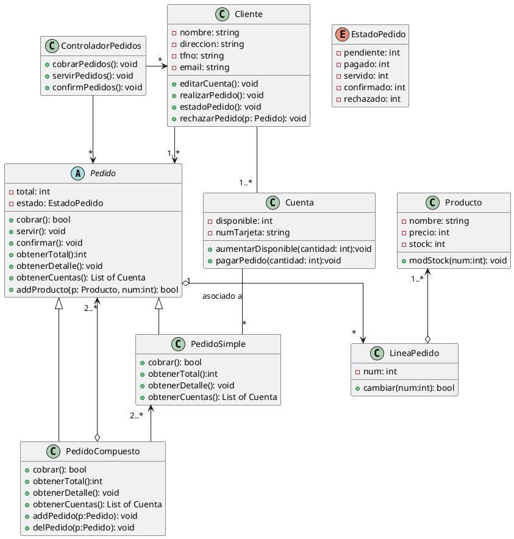

# Gestión de pedidos

Realiza el diseño de una aplicación para la gestión de pedidos. La aplicación deberá manejar clientes (se guarda su nombre, dirección, teléfono y e-mail), que pueden realizar pedidos de productos, de los cuales se anota la cantidad en stock. Un cliente puede tener una o varias cuentas para el pago de los pedidos. Cada cuenta está asociada a una tarjeta de crédito, y tiene una cierta cantidad disponible de dinero, que el cliente debe aumentar periódicamente para poder realizar nuevos pedidos.realizar nuevos pedidos. 

Un cliente puede empezar a realizar un pedido sólo si tiene alguna cuenta con dinero disponible. Al realizar un pedido, un cliente puede agruparlos en pedidos simples o compuestos. Los pedidos simples están asociados a una sola cuenta de pago y (por restricciones en la distribución) contienen un máximo de 20 unidades del(por restricciones en la distribución) contienen un máximo de 20 unidades del mismo o distinto tipo de producto. A su vez, un pedido compuesto contiene dos o más pedidos, que pueden ser simples o compuestos. Como es de esperar, el sistema debe garantizar que todos los pedidos simples que componen un pedido compuesto se paguen con cuentas del mismo cliente. Además, sólo es posible realizar peticiones de productos en stock. 

Existe una clase (de la cual debe haber una única instancia en la aplicación) responsable del cobro, orden de distribución y confirmación de los pedidos. El cobro de los pedidos se hace una vez al día, y el proceso consiste en comprobar todos los pedidos pendientes de cobro, y cobrarlos de la cuenta de pago correspondiente. Si una cuenta no tiene suficiente dinero, el pedido se rechaza (si es parte de un pedido compuesto, se rechaza el pedido entero). Una vez que el pedido está listo para servirse, se ordena su distribución, y una vez entregado, pasa a estar confirmado. 

Se pide un diagrama de clases de diseño. Añade las restricciones OCL necesarias.

