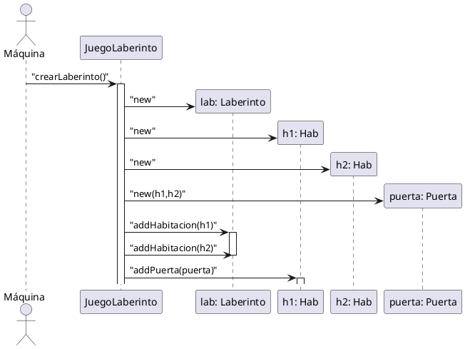

# Laberinto

Especifica el diagrama de secuencia para la siguiente operación

```java
public class JuegoLaberinto {
    public Laberinto crearLaberinto () {
        Laberinto lab = new Laberinto();
        Habitacion h1 = new Habitacion();
        Habitacion h2 = new Habitacion();
        Puerta puerta = new Puerta(h1, h2);
        lab.addHabitacion(h1);
        lab.addHabitacion(h2);
        h1.addPuerta(puerta);
        return lab;
    }
}
```


