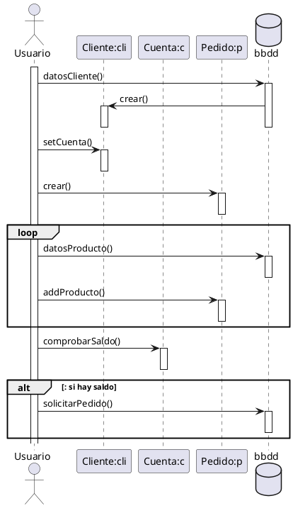

# Pedido

```plantuml
@startuml
actor Usuario
participant cliente as "Cliente:cli"
participant cuenta as "Cuenta:c"
participant pedido as "Pedido:p"
database bbdd

activate Usuario
Usuario -> bbdd : datosCliente()
activate bbdd
bbdd -> cliente : crear()
activate cliente
deactivate bbdd
deactivate cliente
Usuario -> cliente: setCuenta()
activate cliente
deactivate cliente

Usuario -> pedido : crear()
activate pedido
deactivate pedido

loop
    Usuario -> bbdd : datosProducto()
    activate bbdd
    deactivate bbdd
    Usuario -> pedido : addProducto()
    activate pedido
    deactivate pedido
end

Usuario -> cuenta: comprobarSaldo()
activate cuenta
deactivate cuenta

alt : si hay saldo
    Usuario -> bbdd : solicitarPedido()
    activate bbdd
    deactivate bbdd
end
@enduml
```