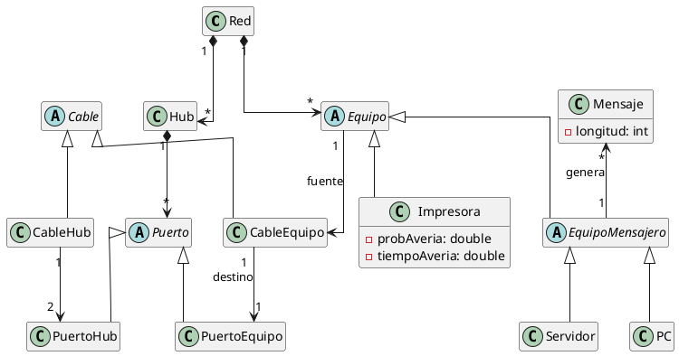

# Red de ordenadores

Describe redes de ordenadores:

- se pueden incluir: Servidor, PC, Impresora, Hub, Cable de red
- Los pcs se pueden conectar a un único Hub, los servidores con uno o varios
- Los servidores y pcs pueden generar mensajes con cierta longitud
- Los hubs tienen un número de puertos, algunos de los cuales pueden usarse para conectar con otros hubs. Tiene probabilidad de perder mensajes
- Las impresoras pueden averiarse, con ciert probab. durante cierto tiempo.

