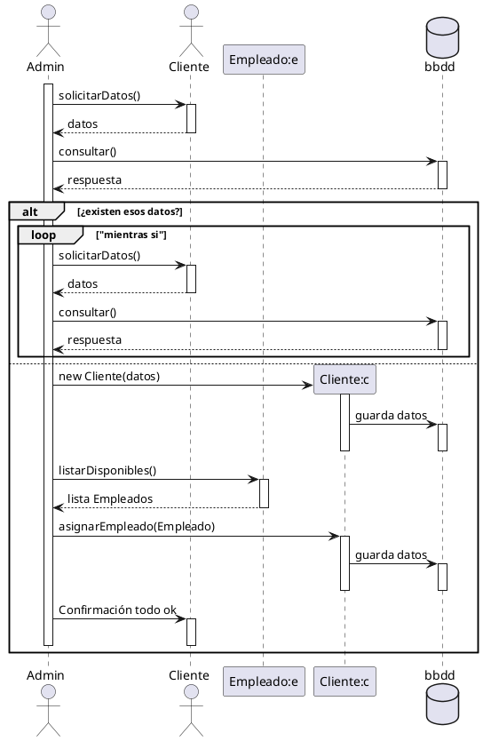

```plantuml
@startuml

actor Admin
actor Cliente
participant e as "Empleado:e"
database bbdd order 30

activate Admin
Admin -> Cliente : solicitarDatos()
activate Cliente
Cliente --> Admin : datos
deactivate Cliente

Admin -> bbdd : consultar()
activate bbdd
bbdd --> Admin : respuesta
deactivate bbdd
alt ¿existen esos datos?
    loop "mientras si"
        Admin -> Cliente: solicitarDatos()
        activate Cliente
        Cliente --> Admin : datos
        deactivate Cliente
        Admin -> bbdd : consultar()
        activate bbdd
        bbdd --> Admin : respuesta
        deactivate bbdd
    end
else
    create c as "Cliente:c"
    Admin -> c: new Cliente(datos)
    activate c
    c -> bbdd : guarda datos
    activate bbdd
    deactivate bbdd
    deactivate c

    Admin -> e : listarDisponibles()
    activate e
    e --> Admin : lista Empleados
    deactivate e

    Admin -> c : asignarEmpleado(Empleado)
    activate c
    c -> bbdd : guarda datos
    activate bbdd
    deactivate bbdd
    deactivate c

    Admin -> Cliente : Confirmación todo ok
    activate Cliente
    deactivate Cliente
    deactivate Admin
end

@enduml
```