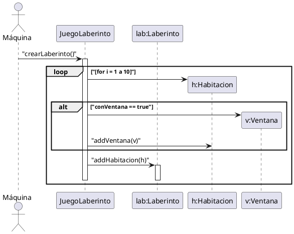

# Laberinto

Especifica el diagrama de secuencia para la siguiente operación

```java
public class JuegoLaberinto {
    private Laberinto lab;
    private boolean conVentana;

    public JuegoLaberinto() {
        lab = new Laberinto();
        conVentana = true;
    }

    public void crearLaberinto() {
        Habitacion h;
        for (int i = 0; i <10); i++){
            h = new Habitacion();
            if (conVentana) {
                h.addVentana(new Ventana());
            }
            lab.addHabitacion(h);
        }
    }
}
```


