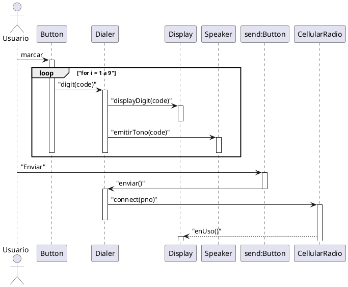

# Llamada de un teléfono móvil

- El usuario pulsa los dígitos del número
- Para cada dígito:
    - La pantalla se actualiza para mostrar el número
    - Se emite un tono
- El usuario pulsa "enviar"
- El indicador "en uso" se ilumina
- El móvil se conecta a la red
- Los números acumulados se envían
- Se establece la conexión con el número marcado

