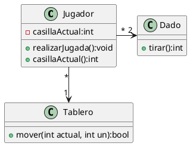
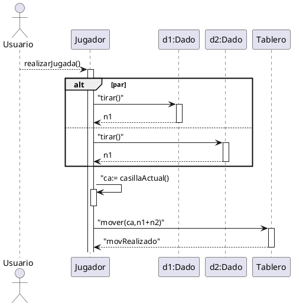

# Parchís

Crear el diagrama de secuencia para la operación `realizarJugada` definida en la clase **Jugador** del juego _Parchís_.

Este sería el **diagrama de clases**

Y este sería el de secuencias:

