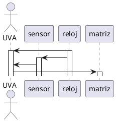

# Sistema de visión artificial

Se necesita realizar el diagrama de secuencia de un sistema de visión artificial para clasificar cacahuetes. El sistema está formado por la unidad de visión artificial la cual recibe datos de 50 sensores.

Los sensores se colocan sobre la cinta transportadora y lo que hacen es transmitir un código que es el color de lo que hay debajo de ellos. Los cacahuetes tienen un color marrón claro pero los que están malos son más oscuros.

Al recibir la unidad de visión el código, esta activará un dedo de una matriz de dedos que lo que hacen es expulsar el cacahuete malo.

Todo esto se hace de manera sincronizada con el reloj del sistema y la cinta transportadora. De hecho los sensores de visión artificial están sincronizados con el reloj del sistema.

Se pide realizar el diagrama de secuencia

