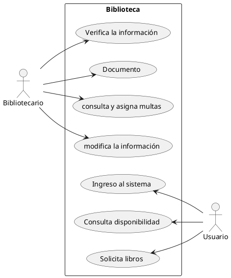

# Casos de uso de una biblioteca

```plantuml
@startuml
left to right direction
actor Bibliotecario
actor Usuario
rectangle Biblioteca {
    Bibliotecario --> (Verifica la información)
    Bibliotecario --> (Documento)
    Bibliotecario --> (consulta y asigna multas)
    Bibliotecario --> (modifica la información)

    (Ingreso al sistema) <-- Usuario
    (Consulta disponibilidad) <-- Usuario
    (Solicita libros) <-- Usuario
}

@enduml
```