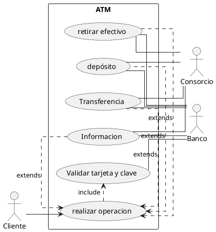

# Cajero automático

Se ha de realizar el diagrama de casos de uso de un cajero automático en el que se pueden realizar las operaciones siguientes:

- Retirar efectivo.
- Ingresar o depositar efectivo.
- Hacer transferencias.
- Obtener información de nuestra cuenta: movimientos, saldo, etc.

Para realizar cualquiera de las operaciones el cajero automático ha de validar la tarjeta y la clave que introduce el usuario.  Se debe considerar la interacición que tiene con el cajero, a la hora de realizar estas operaciones, el banco y el consorcio.  Llamaremos consorcio a la red de cajaros automáticos a las que se suscriben los bancos para que los cajeros automáticos realicen las operaciones.  En España los consorcios son: 4B, servired, red6000.

