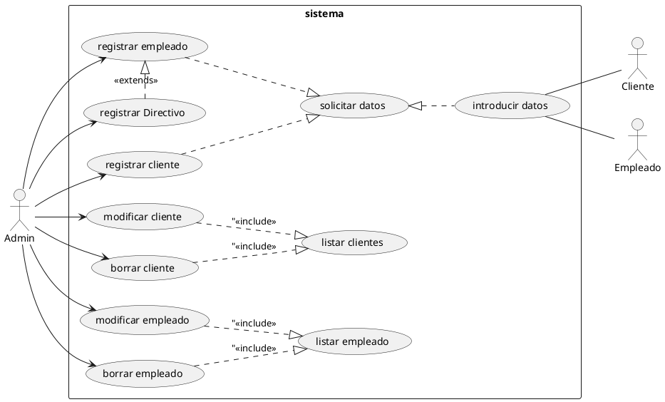

```plantuml
@startuml
left to right direction
' skinparam linetype ortho
actor Admin
actor Cliente
actor Empleado

rectangle sistema {
' Casos
Admin --> (registrar cliente)
Admin --> (modificar cliente)
Admin --> (borrar cliente)
Admin --> (registrar empleado)
Admin --> (registrar Directivo)
Admin --> (modificar empleado)
Admin --> (borrar empleado)
' includes
(modificar cliente) ..|> (listar clientes): "<<include>>
(borrar cliente) ..|> (listar clientes): "<<include>>
(modificar empleado) ..|> (listar empleado): "<<include>>
(borrar empleado) ..|> (listar empleado): "<<include>>
(registrar cliente) ..|> (solicitar datos)
(registrar empleado) ..|> (solicitar datos)
(registrar empleado) <|. (registrar Directivo): "<<extends>>"
(solicitar datos) <|.. (introducir datos)
(introducir datos) -- Cliente
(introducir datos) -- Empleado
}
@enduml
```