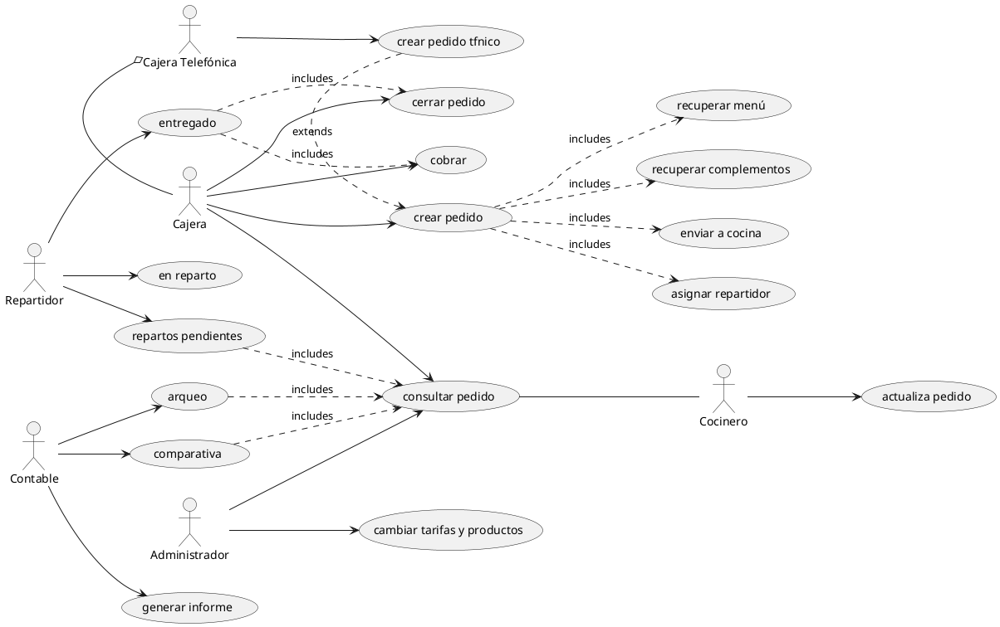
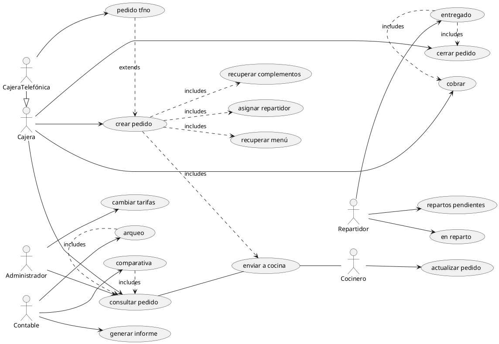

# Hamburguesería

Se desea crear el esquema de casos de uso de un establecimiento de hamburguesas.

La cajera del establecimiento tiene que crear un pedido para lo cual tiene que recuperar los menús y los posibles complementos individuales e ir seleccionando los que el cliente va pidiendo. Una vez que realiza el pedido ejecuta el cobro y envía la comanda a cocina.

Los cocineros van terminando las hamburguesas, wraps, nuggets y demás elementos de los menús de los clientes y lo van anotando en el sistema.

De que la cajera ve en pantalla que tiene terminados todos los componentes de un pedido los agrupa en una bandeja y lo entrega al cliente marcando el pedido como entregado.

En ocasiones el pedido es recibido por teléfono. Un pedido por teléfono es como un pedido normal pero hay que anotar en el sistema que se ha realizado por teléfono y un repartidor se encargará de entregarlo. Deberemos anotar el nombre del repartidor de tal manera que cuando el repartidor vea en el sistema que tiene un pedido pendiente de repartir, lo anota como en reparto y lo lleva al cliente. Una vez entregado el repartidor marca el pedido como entregado y cobrado.

Tanto las cajeras como los repartidores pueden realizar el cobro del pedido.

Los administradores del sistema o persona con poder de administrador revisarán periódicamente los precios y los adecuarán a la tarifa vigente pudiendo añadir o eliminar menús y complementos individuales.

Diariamente, semanalmente y mensualmente el contable realizará un arqueo de caja y comprobará con el sistema que el dinero recaudado es igual que el que figura en el sistema. Además podrá ver comparativamente la evolución de las ventas de forma diaria, semanal y mensual para la evolución de ventas del restaurante. El objetivo de este último punto es emitir un informe al propietario para mantenerlo informado de la situación de su restaurante.

## Diagrama de casos de uso

