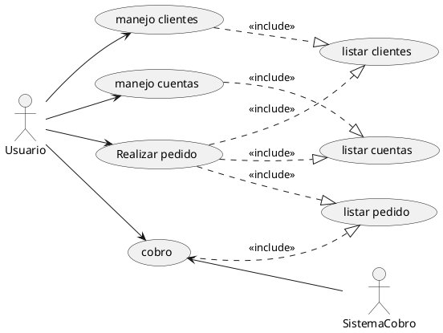

# Pedido

Diagrama de casos de uso

```plantuml
@startuml
left to right direction
actor Usuario
actor SistemaCobro

Usuario --> (manejo clientes)
(manejo clientes) ..|> (listar clientes): "<<include>>"
Usuario --> (Realizar pedido)
(Realizar pedido) ..|> (listar clientes): "<<include>>"
(Realizar pedido) ..|> (listar pedido): "<<include>>"
(Realizar pedido) ..|> (listar cuentas): "<<include>>"
Usuario --> (manejo cuentas)
(manejo cuentas) ..|> (listar cuentas): "<<include>>"
Usuario --> (cobro)
(cobro) ..|> (listar pedido): "<<include>>"
(cobro) <-- SistemaCobro
@enduml
```