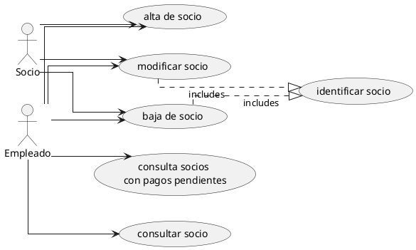
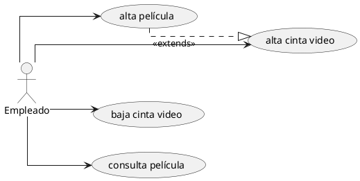
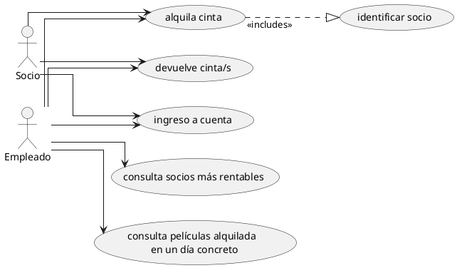

# Videoclub

Una tienda de alquiler de películas de Bogotá posee alrededor de 5000 vídeo-casetes de los que requiere llevar registro.Cada uno de los vídeos casetes tiene un número de cinta. Para cada película, se necesita conocer título, duración, director y la categoría según la siguiente clasificación: drama, acción, suspenso, comedia,guerra y ciencia-ficción.

Existen muchas copias de la mayoría de laspelículas, Se le asigno a cada película un identificador específico, y así se puede saber en que vídeo casete se encuentra esta película. Un vídeo casete puede ser tanto formato Beta o VHS. Siempre se tiene por lo menos un vídeo casete de cada película que se registra, y cada película es siempre copiada a un vídeo casete individual y específico.Algunos de los vídeo casetes son muy largos, así que se tienen tengo películas que ocupan múltiples vídeo casetes.

Nuestros clientes al momento de solicitar en alquiler un video casete,frecuentemente nos pregunta por los protagonistas de la película que quiere alquilar. Así, que se debe llevar el registro de los actores que aparecen en cada película. No todas las películas tienen actores. A los clientes les gustaría conocer el nombre real del actor, edad y estado civil. Solamente se llevan registros de actores que aparecen en laspelículas de la tienda.La tienda de video casetes tiene muchos clientes y solamente alquila vídeos a personas que sean socias del vídeo club.

Para que una persona pueda pertenecer al video club como socio debe afiliarse, para lo cual se le asigna un número que lo identifica y se deben registrar sus nombres y apellidos, número telefónico, dirección de residencia.

Se necesita llevar el registro de que vídeo casete ha alquilado cada socio en un momento determinado. Un cliente puede alquilar varios vídeo-casetes simultáneamente. Necesitamos registrar el histórico de todos los alquileres realizados.Cada vez que un cliente alquila un video, se debe registrar la fecha dealquiler, el día que devolverá el video. Todos los video casetes deben ser devueltos a la tienda a más tardar tres días después de su alquiler, y, en caso de no entregarse a tiempo, se cobrara una multa de 1€ por película y día de retraso. El histórico de alquiler de videos se requiere con el fin de analizar el comportamiento del alquiler de videos. Con el histórico seremos capaces de determinar cuantas cintas alquila cada cliente y cuantas veces un cliente ha devuelto una cinta tarde. También necesitamos saber cuantas veces una cinta ha sido usada, y saber cuando retirar dicha cinta. También podremos analizar las preferencias de nuestros clientes y conocer el valor en Euros recibido por el concepto de alquiler de videos y multas por retrasos. Próximamente la tienda de video-casetes empezará con el alquiler deDVD(s), así se sería importante llevar el registro del alquiler de películasen estos medios. La política de grabación y alquiler de DVD(s) será lamisma utilizada para los video casetes.

## Subsistema: gestión de socios

## Subsistema: gestión de películas

## Subsistema: gestión de alquileres

